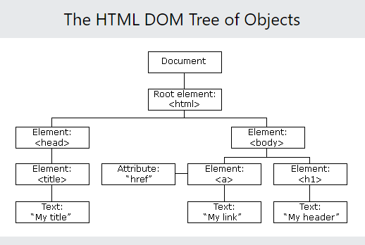

# TIL

## JAVASCRIPT 문서 구조

---

1. 자바스크립트
   - 동작에 대응하여 반응이 일어날 수 있도록 해주는 언어
   - 인터프린트 언어 (코드가 작성된 순서대로 윗줄부터 순차대로 구문분석을 한다.)
   - 클라이언트 스크립트 언어 (서버에서 실행되는 것이 아니라 사용자 컴퓨터에서 실행된다.)
   - 객체 기반 언어
2. 자바스크립트 역사
   - 1995년 '넷스케이프'의 '브랜든 아이크'가 만듬
   - 동적인 웹페이지를 만들기 위해 브라우저에서 동작하는 가벼운 프로그래밍 언어를 개발함
   - Mocha > LiveScript > JavaScript
   - 브라우저에 따라 정상적으로 동작하지 않는 크로스 브라우징 이슈가 발생. 이후 표준화의 필요성을 깨닫고 '넷스케이프'에서 'ECMA International'에 자바스크립트 표준화를 요청
   - 1997년 7월 ECMA-262라 불리는 표준화 발행
   - 이후 2009년 ECMAScript5는 HTML5와 함께 출현한 표준사양
3. 최근 버전
   - ES6(2015년) let/const, arrow function(veu, angular, react), class, module 등 범용 프로그래밍 언어로서 갖춰야 할 기능 대거 도입. 이후 매년 기능을 추가하여 발표
4. front-end
   - 브라우저별로 사용하는 자바스크립트 엔진이 다르다.
   - Ajax : 자바스크립트를 이용해 서버와 브라우저가 비동기방식(요청과 응답 사이에서 다중 작업이 가능한 기능. 작업방식의 순서에 상관 없이 실행이 가능한 기능)으로 데이터를 교환할 수 있는 통신 기능
   - jQuery : 2006년 등장. 다소 번거롭고 논란이 있던 DOM을 쉽게 제어할 수 있게 되었고 크로스 브라우징 이슈도 어느 정도 해결되었다.
   - V8 자바스크립트 엔진 : 2008년 자바스크립트의 속도 개선을 위해서 고안되었다. 속도향상을 위해 자바스크립트 코드를 더 효율적인 머신 코드로 번역한다.
5. front-end & back-end
   - Node.js : 2009년 라이언 달이 발표. 프론트엔드와 백엔드 동시에 구동이 된다.
   - SPA(Single Page Application) : 하나의 페이지 안에서 데이터를 받아와서 필요한 부분만 부분적으로 업데이트를 할 수 있는 기능. REACT, ANGULAR, VUE 등 라이브러리가 제공된다.
6. JavaScript standard code : 자바스크립트 문서 규약
   - 자바스크립트는 대소문자를 가려서 쓴다.
   - 문자열에는 작은따옴표를 사용한다.
   - 들여쓰기를 할 때는 공백 2개를 사용한다 ...
   - -https://standardjs.com/rules-kokr.html (공식문서)

---

## 1. 명명 표기법

- 명칭규칙을 의미한다.
- 식별자의 명칭은 프로젝트, 프로그래밍언어, 개발도구 등에 따라 다를 수 있다.
- 명명표기법을 따르는 목적은 가독성, 효율성을 높이기 위해서이다.

> 대표적인 표기법 종류

- 헝가리안 표기법 : 데이터 종류 등의 약어를 이름 앞에 붙여 표기해주는 방법
- 카멜 표기법 : 이름의 시작은 소문자. 두번째 단어부터는 그 단어의 시작글자만 대문자로 표기하는 방법(표기법이 낙타의 모양과 비슷하여 카멜 표기법이라 명칭한다.)
- 파스칼 표기법 : 모든 단어의 첫 글자를 대문자로 표기하는 방법
- 스네이크 표기법 : 단어간의 연결을 언더바'\_'로 표기하는 방법

---

## 2. 자바스크립트 선언문

- script type="text/javascript"
- document.write(); : 웹 페이지가 로딩될 때 실행되면, 웹 페이지에 가장 먼저 데이터를 출력
- console.log(); : 웹 브라우저의 콘솔을 통해 데이터를 출력
- window.onload(); : 해당 함수 내의 스크립트는 웹브라우저 내의 모든 요소가 준비가 되어야 실행이 되게끔 할 수 있는 코드

---

## 3. 식별자(idntifier) : 프로그램 구현에 필요한 이름을 정의

- 변수명(카멜 표기법)
- 함수명(카멜 표기법)
- 클래스명(파스칼 표기법)

---

## 4. 키워드(예약어) (keyword)

: 프로그램에서 의미를 부여해서 정의해놓은 단어

---

## 5. 호이스팅(hoisting)

: 변수 선언을 최상위로 끌어올리는 작업

    - 일시적 사각지대
        let변수와 const 변수는 호이스팅이 진행되면 주어진 위치에 고정이 되어 코드값이    실행이 되지 않을 수 있다.
        허나, 데이터값이 지워지지는 않고 존재하여 일시적 사각지대에 놓이게 된다.
        즉, 데이터는 아직 존재한다.

---

## 6. 변수(variable) : 데이터를 저장하기 위한 메모리 공간

> 변수 선언 규칙

1.  첫 글자는 숫자 포함 불가
2.  첫 글자 이후 글자는 숫자도 포함 가능
3.  특수기호는 $와\_만 가능
4.  대소문자를 구분함
5.  'var' 등의 자바스크립트 내부 키워드는 사용불가

    - var(변수) : 중복사용 가능
    - let(변수) : 중복사용 불가능
    - const(상수) : 하나의 값을 고정

          변수의 스코프(scope) : var, let
             1. var는 변수가 사용되는 범위가 전역, 함수 내부 로컬 2가지만 가능하다.
             2. let은 변수가 사용되는 범위가 전역, 함수 내부 로컬, 코드블록, 표현식 로컬드의 정의에 사용 가능하다.

    - 변수 선언 : 변수 식별자(변수명) = 값; (결과 = 식 순으로 진행된다.)

    - 출력기호 : %d(숫자), %f(실수)/%.1f(표준표시방식), %s(문자열), ${}(논리)/%b(자바용)

6.  연산자(operator) : 연산을 하기 위해서 사용되는 기호(산술, 비교. 논리, 조건, 대입)
    피연산자(operand) : 연산에 사용되는 데이터

    - 단항연산자 : 연산자가 1개일 때
    - n항연산자 : 연산자가 n개일 때

    - 산술연산자 : +, -, \*, /, %(나머지), ++(증가), --(감소)
    - 논리연산자 : &&(and), ||(or), !(not)
    - 비교연산자 : >, <, >=, <=, ==, !=, ===(메모리에 저장된 값만 비교), !==(메모리에 저장된 값과 데이터 타입을 비교)
    - 조건연산자 : 조건식 ? true : false

    > 연산자 우선순위

    - 단항연산자 > 산술 > 비교 > 논리 > 조건 > 대입

---

## 8. 자료형(datatype) : 데이터의 종류

> primitive type(기본 데이터 타입, 원시 데이터) : 불변. 값을 바꾸게 되면 기존의 값을 지우지 않고 새롭게 만든다.

- 숫자(number), 문자(string), 논리(boolean), undefined(자바스크립트 엔진에서 체크한 데이터), null(직접 값을 준 데이터)

> reference type(참조 데이터 타입) : 가변. 주소를 만들어 객체에 주소를 저장한다. (object)
>
> 값을 바꾸게 되면 기존의 값을 지우고 새로운 값이 저장된다.

- 배열 (Array)

  : [x, y] - 직관적으로 구분이 안된다.

  : 배열로 값을 주면 값에 index가 주어진다.

  : 배열에 있는 각각의 값을 element라 부른다.

- 객체 (Object)

  : {x:n, y:n-1} - 직관적으로 구분이 가능하다.

  : 리터럴(property) {property:value, property:value}

  : java에서는 element(요소)를 가져옴 for(String element : city)

  : javascript에서는 index를 가져옴 for(let idx in city){}

- 함수 : function
- new String, new Number ....

  : 일반적인 string(원시데이터)의 주소가 아닌 new로 새로운 주소를 만들어 그곳에 데이터(객체)를 저장한다.

> typeof : 어떠한 데이터 타입인지 알아보기 위해 사용한다.
>
> instanceof : 객체가 정확히 어떠한 타입인지 알아보기 위해 사용한다.

---

## 9. 제어문(statement)

: 프로그램의 흐름을 제어할 수 있는 실행문

- 조건문 : if~else

- 선택문 : switch~case
- 반복문 : for, whil, do~while, for~in, for~of
- label(임의의 이름을 정의), continue(for), break(switch)

## (1) 조건문

: 조건식의 값이 참인지 거짓인지에 따라 실행문의 제어가 결정된다.

---

### **1. if 문**

: 조건식이 만족(true)할 경우에만 실행문을 실행한다.

---

## 조건문(if)식 예시

       - if 기본 조건식
         if(조건식){
         실행문;
          }

      - if~else 조건식
          if(조건식){
          실행문;
          }else{
          실행문;
          };

      - 여러 조건식이 필요할 때의 조건식
          if(조건식1){
          실행문1;
          }else if(조건식2){
          실행문2;
          }else if(조건식3){
          실행문3;
          }else{
          실행문4;
          }

---

> 선택문 : 변수에 저장된 값과 switch문에 있는 case(경우)의 값을 검사하여,
>
> 변수와 경우의 값에서 일치하는 값이 있을 떄 그에 해당하는 실행문을 실행한다.

### **2. switch 문**

: switch문은 변수에 저장된 값과 switch문에 있는 경우(case)의 값을 검사하여, 변수와 경우의 값에서 일치하는 값이 있을 때 그에 해당하는 실행문을 실행한다.

---

### [선택문(switch)식 예시]

      - switch(식){
          case 값1 : 실행문1; break;
          case 값2 : 실행문2; break;
          case 값3 : 실행문3; break;
          default : 실행문;
          }

## (2) 반복문

---

### **1. for 문**

: 조건식을 만족할 때까지 특정 실행문을 반복해서 실행한다.

: 초기식과 조건식은 생략이 가능하다.(조건식을 생략하게 되면 무한으로 돌아간다.)

---

### [반복문(for)식 예시]

      - for(초기값; 조건식; 증감식){
          실행문;
          }

      - 중첩반복문
          for(초기값; 조건식; 증감식){
          for(초기값; 조건식; 증감식){
          실행문;
          }
          }

> 초기식 -> 조건식(true) -> 실행문 -> 증감식
> -> 조건식(true) ->실행문 -> 증감식
> -> 조건식(false) or break; -> 반복문 빠져나감

     - continue

    1. 반복문에서 continue를 만나면 조건식으로 이동한다.
    2. if문에서는 증감식을 걸쳐 조건식으로 이동한다.
    (참조) https://developer.mozilla.org/ko/docs/Web/JavaScript/Reference/Statements/continue

    - 이스케이프 : 프로그램에서 주변 장치를 컨트롤 하기 위해서 사용되는 기능
    - 이스케이프 종류 : \n : 줄바꿈, \t : 탭, \", \', \b : 백스페이스, \v : 수직탭
    - 이스케이프 사용법 : preocess.stderr.write(`\n`);
    (참조)https://developer.mozilla.org/ko/docs/Web/JavaScript/Reference/Global_Objects/String#%EA%B5%AC%EB%AC%B8

    - length : 요소의 개수를 리턴해준다.(length(): method / legth : keyword)

### **2. while문**

: 무한으로 값(파일 등)을 가져올 때 사용한다.

: 조건식 생략이 안된다.

: do~while 문은 조건문의 결과와 상관 없이 무조건 1번은 실행된다.

---

### [반복문(while)식 예시]

      - while(조건식){
        실행문;
        }

      - do(
        실행문;
        )while(조건식);

### **3. for~in 문**

: 배열로 값을 주면 index가 주어진다.

: 배열에 있는 각각의 값을 element라 부른다.

: index를 가져온다.(index에 주어진 데이터를 불러올 수 있다.)

: for() => for ~ in : index

---

### [for~in 식 예시]

      - let x = { a: 1, b: 2, c: 3};
          for (let y in x) {
          console.log(y y[x]);
          }

결과 값 : a 1, b 2, c 3

### **4. for~of 문**

: 반복 가능한 객체(Array, String, Map, Set, arguments)를 반복하는 객체.

: 즉, iterable 속성을 가진 객체만 가능

: element를 가져온다.

: for() = > for ~ of : element

---

### [for~of 식 예시]

    - let s = ['red', 'green', 'blue'];
        for (let k of s) {
        console.log(k);
        }
        결과 값 : red, green, blue

---

## 10. 함수(function)

: 특정기능을 하는 구문을 독립된 부품으로 만들어 재사용하고자 할 때 사용하는 문법.  
 (전역 변수 : 함수의 외부에서 선언된 변수)

    Arguments 객체

    - 함수 안에서만 기본으로 사용할 수 있는 자바스크립트 객체이다.
    - 함수 런타임 시점에 자동으로 생성되는 객체이며, 함수 코드 및 파라미터는 무관하게 자동 생성된다.
    - 함수를 호출할 때 함수로 전달된 실제 인자들의 정보를 담고 있는 객체이다.
    - 함수 선언에서 파라미터로 정의한 변수 갯수보다 실제 함수를 호출할 때 전달하는 인수의 갯수가 다를 수 있는 자바스크립트의 특성을 고려해 만들어진 객체이다.

    Parameter(기본파라미터) : ES6-2015

    Rest Parameter(나머지 파라미터)
    - 파라미터 갯수를 가변으로 사용할 수 있도록 제공해주는 연산자
    - spread operator(점 3개(...))를 맨 마지막 파라미터로 사용해주면 된다.
    - 단독으로 사용
    - 맨 마지막에 작성 해주어야 한다.
    - 한번만 사용해야 한다.

---

### [함수 정의]

    - 함수 선언문
        function 함수명(매개변수=parameter) {
        실행문;
        return 값;
        }

    - 함수 표현식
        let 변수 = 함수명(인수= arguement){
        실행문;
        return 값;
        }

    - 즉시 실행(익명 함수)
        (function(param){
        console.log(`${param} run~~~`);
        })('test');

---

### 함수의 종류

1. 중첩 함수

   - 기존 함수안에 또다른 함수를 넣어 값을 구하는 경우

2. 콜백 함수

   - 다른 함수의 인수(arguments)로 사용되는 함수
   - 어떤 이벤트에 의해 호출되는 함수
   - brn.oneclick=function(){}

3. 클로저(closure)

   - 중첩함수는 outer(외부)함수가 끝나면 외부에서 outer(외부)함수의 자원을 사용할 수 없다.
   - 클로저는 outer(외부)함수보다 중첩 함수가 더 오래 유지되는 경우 중첩 함수는 이미 생명주기가 종료한 외부함수의 변수를 참조할 수 있다. 이러한 중첩함수가 클로저(closure)이다.
   - 클로저는 변수가 의도치 않게 변경되지 않도록 안전하게 은닉(information hiding)하고 특정 함수에게만 상태 변경을 허용하여 상태를 안전하게 변경하고 유지하기 위해 사용한다.

4. 재귀함수
   - 함수는 자기 자신을 호출할 수 있다. 허나 사용하지 않는 것이 좋다.(메모리의 용량을 많이 차지하기 떄문)

---

## 11. 표준 내장 객체

: 자바스크립트는 프로토타입의 객체이다.  
: 전역 범위의 여러 객체.  
: 참조 (https://developer.mozilla.org/ko/docs/Web/JavaScript/Reference/Global_Objects)  
: 원시데이터타입(primitive type)에 '.' 을 붙이면 객체(object)로 변한다.

    - toString()
      : object나 배열 등 값을 string으로 바꿔준다.
    - valueof()
      : object를 primitive로 바꿔준다.
    - parseInt()
      : 실수를 정수로 바꿔준다.
    - parseFloat()
      : 실수의 값을 전부 출력한다.
    - length
      : 요소의 개수를 출력한다.

---

### 1. Number

    - new Number(인수)
    : 내장객체, 내부객체로 이동
    : typeof =  object

---

### 2. String

: 문자열을 나타내는 객체이다.

    - 특정 범위의 데이터를 리턴해주는 3가지 메소드
        1. substring(start, end); (음수값 지원x)
        2. substr(start, length);
        3. slice(start, end);
        : '-숫자' 값을 입력하면 맨 마지막 문자부터 아랫차순으로 내려간다.
    - replace('찾을 문자열', '바꿀 문자열')
        : 기존의 문자열을 다른 문자열로 바꿀 때 사용
        : 원본 데이터는 지워지지 않는다.
        : 원본 데이터를 복사하여 새롭게 만든 데이터값이다.
    - 영어 대문자, 소문자 찾기
        : /문자/i(대소문자 구분 없음), /문자/g(모든 문자열)
    - 대문자 소문자 치환
        : toUpperCase() 모두 대문자로 표기
        : toLowerCase() 모두 소문자로 표기
    - concat()
        : + 와 비슷한 성질. 요소를 합쳐준다.
    - split()
        : 문자열을 나눠준다.
    - match()
        : 검색 데이터와 일치하는 문자열이 있으면 문자열 모두를 찾아서 배열로 리턴하고 일치하는 문자열이 없으면 null로 리턴한다.
    - search()
        : 검색데이터와 일치하는 문자열이 있으면 처음의 index를 리턴하고 일치하는 문자열이 없으면 -1을 리턴한다.
    - indexOf() / lastIndexOf()
        : 문자열의 인덱스를 리턴한다. / 역순으로 문자열의 인덱스를 리턴한다.
    - repeat()
        : 문자를 반복해서 사용한다.
    - trim()
        : 문자열의 양쪽에 위치한 공백을 지워준다.
        : 문자열 사이의 공백은 지우지 않는다.

---

### 3. Array

: 리스트 형태의 객체인 배열을 나타내는 객체이다.

    [] : 생략이 가능하다는 뜻
    Math.sqrt : 숫자의 제곱근 출력(리턴,반환)
    - forEach()
        : 배열 전용 메소드
        : 배열.forEach(function(element[, index]){수행할 문장})
        : 문자열은 forEach()를 제공하지 않으므로 사용할 수 없다.
        : 주어진 함수를 배열 요소 각각에 대해 실행한다.
    - map()
        : 배열.map(callback(함수))
        : 배열 내의 모든 요소 각각에 대하여 주어진 함수를 호출한 결과를 모아 새로운 배열을 반환하는 메서드
    - reduce()
        : 이전요소와 현재요소와의 관계를 어떻게 만들지 결정하는 메서드
    - filter()
        : 주어진 함수의 테스트를 통과하는 모든 요소를 모아 새로운 배열로 반환하는 메서드
    - join()
        : 문자열 사이에 값을 추가하는 메서드
    - push()
        : 배열의 끝에 요소를 추가하는 메서드
    - pop()
        : 배열의 끝에 요소를 제거하는 메서드
    - unshift()
        : 배열의 앞에 요소를 추가하는 메서드
    - shift()
        : 배열의 앞에 요소를 제거하는 메서드
    - delete 변수[index]
        : index에 위치한 요소를 제거하는 메서드
    - slice(a,b)
        : 특정 범위의 요소를 가져오는 메서드
    - flat()
        : 모든 하위 배열 요소를 지정한 깊이까지 재귀적으로 이어붙인 새로운 배열을 생성하는 메서드
    - 정렬 메서드
        : javascript에서 sort()는 Tim Sort 알고리즘을 사용한다.
        : Tim Sort는 Insertion sort와 Merge Sort를 결합하여 만든 정렬이다.
        : Tim Sort 알고리즘 : https://d2.naver.com/helloworld/0315536
        - sort()
            : 오름차순 정렬
            : 숫자와 문자는 각각 정렬하였을 때 출력 값이 다르다.
            : 예시)
                let point = [40, 100, 1, 5, 10];
                console.log(point.sort());
                값 : [ 1, 10, 100, 40, 5 ]
        - sort().reverse()
            : 내림차순 정렬
            : 예시)
                let point = [40, 100, 1, 5, 10];
                console.log(point.sort().reverse());
                값 : [ 5, 40, 100, 10, 1 ]
        - 숫자의 크기에 따라서 정렬하는 방법
            : 오름차순
                let p = [40, 100, 1, 5, 10];
                console.log(p.sort(function (a,b){
                    return a-b;
                })
                );
                값 : [ 1, 5, 10, 40, 100 ]
            : 내림차순
                let p = [];
                console.log(p.sort(function (a,b){
                    return b-a;
                })
                );
                값 : [ 100, 40, 10, 5, 1 ]
        - concat()
            : 다른 두 배열을 합칠 때 사용

---

### 4. Spread Operator(js15참조)

    [1] 배열에서의 Spread Operator
      1. 배열 복사(Array copy)

      - 얇은 복사(shallow copy)
          : 데이터 값이 저장된 주소를 복사본이 같이 사용한다.
      - 깊은 복사(deep copy)
          : 복사본을 같이 사용하는게 아닌 새로운 주소에 복사하여 사용한다.

      2. 배열 병합(Array Concatenation)

    [2] 함수에서의 Spread Operator
      1. 나머지 매개변수(Rest Parameter)
          : 함수가 정해지지 않은 수의 매개변수를 배열로 받을 수 있다.

      2. 함수 호출 인수

    [3] 객체예시 Spread Oprator
      1. 객체 복사

      2. 객체 업데이트

---

### 5. Destructuring (구조 분해 할당)

    : Destructuring(비구조화)은 Structuring(구조화)된 데이터(배열 또는 객체)를 비구조화 하여 개별적으로 변수에 할당하는 개념이다.

---

### 6. Math

: 수학적인 상수와 함수를 위한 속성과 메서드를 가진 내장 객체

    - Math.max() : 최대값
    - Math.min() : 최소값
    - Math.abs() : 절대값
    - Math.round() : 소수점 반올림(자릿수 지정할 수 없음)
    - Math.ceil() : 소수점 올림
    - Math.floor() : 소수점 버림
    - Math.random() : 난수(0.0 ~ 1.0)
    - Math.toFixed() : 지정한 자릿수에서 반올림

---

### 7. Date

: 시간의 한 점을 플랫폼에 종속되지 않는 형태로 나타낸다.

: Date 객체는 1970년 1월 1일 UTC(협정 세계시) 자정과의 시간 차이를 밀리초로 나타내는 정수 값을 담는다.

    - getFullYear() : 년도
    - getMonth() + 1 : 월(1월의 값을 0으로 처리한다. 현재 월을 알기 위해서는 '+1'을 해주면 된다.)
    - getDate() : 일
    - geyDay() : 요일(0 : 일요일, 6: 토요일)

---

## 12. DOM 문서 객체 모델(The Document Object Model)

: 문서객체모델(The Document Object Model)은 HTML, XML 문서의 프로그래밍 interface이다.

: 문서의 구조화된 표현(structured representation)을 제공하며 프로그래밍 언어가 DOM 구조에
접근할 수 있는 방법을 제공하여 그들이 문서 구조, 스타일, 내용 등을 변경할 수 있게 돕는다.

: nodes(element, text, attribute 등 12가지)와 objects로 문서를 표현한다.

: 브라우저의 동작 원리 및 설명 (https://d2.naver.com/helloworld/59361)

---

### The HTML DOM Tree of Objects

    - Node : 여러 가지 DOM 타입들이 상속하는 인터페이스이며 그 다양한 타입들을 비슷하게 처리할 수 있게 한다.
    - defer : parsing한 HTML문서의 내용에 적용할 script를 파싱이 다 끝난 후 적용한다는 속성
    - alert : 확인 버튼을 가지며 메시지를 지정할 수 있는 경고 대화 상자를 띄운다.
    - document.getElementbyId(''); : 주어진 문자열과 일치하는 id 속성을 가진 요소를 찾고, 이를 나타내는 Element 객체를 반환한다.
    - document.getElementbyTagName('') : 엘리먼트의 HTMLCollection 과 주어진 태그명을 반환한다.
                                       : 루트 노드를 포함해 전체 다큐먼트를 대상으로 검색한다.
    - documet.querySelector('') : 선택자와 일치하는 문서 내 첫 번째 Element를 반환한다.
                                : 일치하는 요소가 없으면 null을 반환한다.
    - Node.style.속성 :  스크립트에서 스타일을 주고싶을 떄 사용.
                      : Node 뒤에 꼭 style을 붙이고 코드작성을 해야한다.
    - Node.parentNode : NodeDOM 트리에서 지정된 노드의 부모를 반환한다.
    - Node.previouSibling : 앞에 이웃을 가져오기 위한 메서드
                          : 부모 목록 Node에서 지정된 노드 바로 앞의 노드를 반환 하거나 지정된 노드가 해당 목록의 첫 번째 노드인 경우 반환합니다.
    - Node.nextSibling : 뒤에 이웃을 가져오기 위한 메서드
                       : 부모의 childNodes 목록에서 지정된 노드 바로 다음에 있는 노드를 반환한다.
    - Node.previouElementSibling : 앞에 이웃의 요소를 가져오기 위한 메서드
    - Node.nextElementSibling : 뒤에 이웃의 요소를 가져오기 위한 메서드
    - Node.childNodes
    - Node.children
    - Node.firstChild, first.ElementChild
    - Node.getArrtibute('속성명'), Node.setAttribute('속성명',값)
    - Node.id = '속성명' : 속성명의 id값을 줄 떄
    - innerText / innerHTML : 요소의 컨텐츠를 가져온다.(텍스트 값만 가져온다. / 여러요소를 가져온다. 배열로 출력이 되니 인덱스 값을 입력하여 가져온다.)

    - event : 문서 객체에 이벤트를 적용하는 속성
        ◦ 요소선택.이벤트종류 = function(){실행할 문장};
        ◦ onclick : 클릭했을 때 출력함
        ◦ onsubmit : 클릭했을 때 데이터를 제출한다.
        ◦ submit() : 강제적으로 sbuit()이벤트를 실행시킨다.
